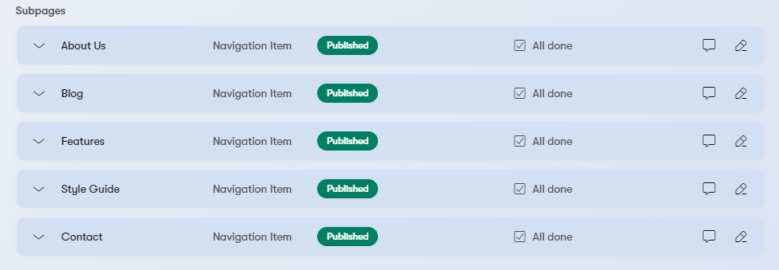
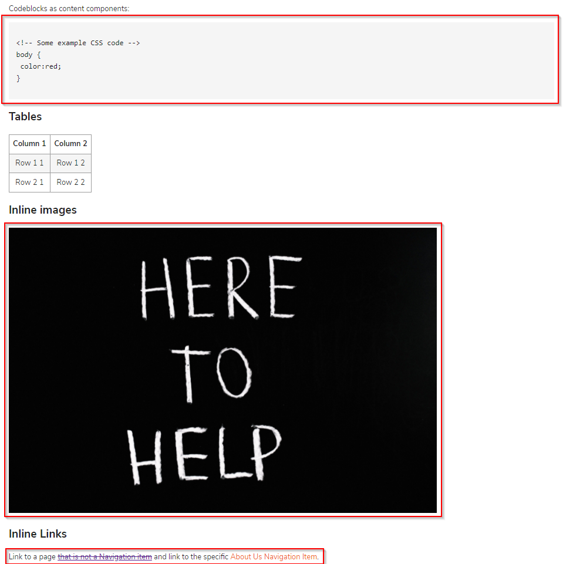
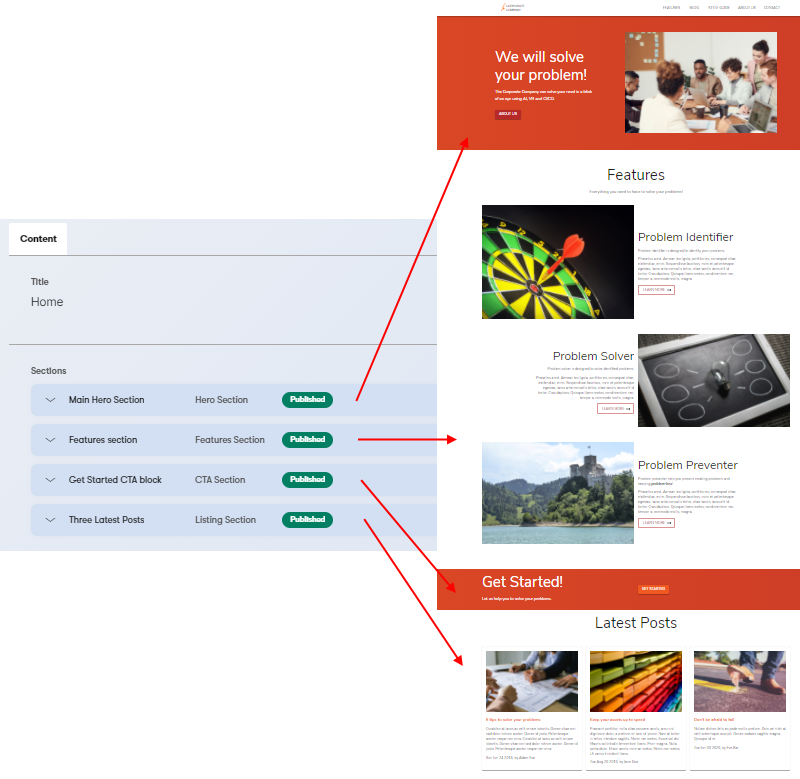
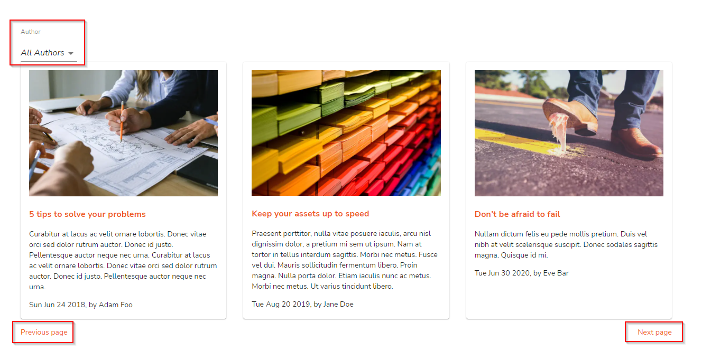

# Kontent Sample app GraphQL React

This sample app showcase Kontent GraphQL API endpoint usage in combination with React.js using Apollo client.

## Getting started

In this section you can find how to get the application ready in development mode.

### Prerequisites

- [Node.js](https://nodejs.org/en/download/) (LTS recommended)

### Run site in development

In the project directory, install all dependencies. And sun development

```sh
npm install
npm start
```

🎉 Open [http://localhost:3000](http://localhost:3000) with your browser to see the result.

#### (Optional) Create your own data source project in Kontent

This optional section allows you to create your own copy of the project in Kontent so that you can make changes. If you skip this step, the application is connected to the published data of a shared project that is read-only via API for you.

##### Create Kontent project

1. Create an account on Kontent
   - [Create an account on Kontent.ai](https://app.kontent.ai/sign-up?utm_source=nextjs_boilerplate_example&utm_medium=devrel).
2. After signing up, [create an empty project](https://docs.kontent.ai/tutorials/set-up-kontent/projects/manage-projects#a-creating-projects).
3. Go to the "Project Settings", select API keys and copy the following keys for further reference
   - Project ID
   - Management API key
4. Use the [Template Manager UI](https://kentico.github.io/kontent-template-manager/import) for importing the content from [`kontent-backup.zip`](./kontent-backup.zip) file and API keys from the previous step. Check _Publish language variants after import_ option before import.

   > Alternatively, you can use the [Kontent Backup Manager](https://github.com/Kentico/kontent-backup-manager-js) and import data to the newly created project from [`kontent-backup.zip`](./kontent-backup.zip) file via command line:
   >
   > ```sh
   >  npm i -g @kentico/kontent-backup-manager
   >  # or
   >  yarn global add @kentico/kontent-backup-manager
   >
   >  kbm --action=restore --projectId=<Project ID> --apiKey=<Management API key> --zipFilename=kontent-backup
   > ```
   >
   > Go to your Kontent project and [publish the imported items](https://docs.kontent.ai/tutorials/write-and-collaborate/publish-your-work/publish-content-items).

##### Environment variables

1. Set up environment variables

   - Copy the `.env.template` file in this directory to `.env` (which will be ignored by Git):

     ```sh
     cp .env.template .env
     ```

1. Run the development server

   ```sh
   npm run start
   ```

🎉 Open [http://localhost:3000](http://localhost:3000) with your browser to see the result.

> By default, the content is loaded from a shared Kentico Kontent project. If you want to use your own clone of the project so that you can customize it and experiment with Kontent, continue to the next section.

|              Variable              | Required | Description              |
| :--------------------------------: | :------: | :----------------------- |
|    REACT_APP_KONTENT_PROJECT_ID    |    NO    | Project identification   |
| REACT_APP_KONTENT_GRAPHQL_ENDPOINT |    NO    | Kontent GraphQL endpoint |

## Content editing development

Run the development server:

```sh
npm start
```

🎉 Open [http://localhost:3000](http://localhost:3000) with your browser to see the result.

You can start editing the page by modifying content in Kentico Kontent project. The page auto-updates as you edit the content, but you need to [publish the changes](https://docs.kontent.ai/tutorials/write-and-collaborate/publish-your-work/publish-content-items) in order to see them on site.

### Available Scripts

- `npm start` - Runs the app in the development mode. Open [http://localhost:3000](http://localhost:3000) to view it in the browser.
- `npm test` - Launches the test runner in the interactive watch mode. See the section about [running tests](https://facebook.github.io/create-react-app/docs/running-tests) for more information.
- `npm build` - Builds the app for production to the `build` folder. It correctly bundles React in production mode and optimizes the build for the best performance. See the section about [deployment](https://facebook.github.io/create-react-app/docs/deployment) for more information.
- `npm eject` - **Note: this is a one-way operation. Once you `eject`, you can’t go back!** If you aren’t satisfied with the build tool and configuration choices, you can `eject` at any time. This command will remove the single build dependency from your project.

## About

This section describes the content model of the site and the use cases that are supposed to demonstrate GraphQL capabilities.

### Content Model

The site is using a simple layout. A header with a Logo and a menu.
Depending on the type of the "Content" you can have one of the layouts:

- **Landing page** - List of various sections displayed as rows.
- **Listing page** - A grid of homogenous content pieces - specifically articles in the sample.
- **Simple page** - A simple page rendering the title, subtitle, image, and rich text element.


## Layout - global/shared data

This data is stored in `Homepage` content item containing information about SEO, sitemap, layout (menu, title, copyright), and logo.

This data loaded in the [App component](./src/App.js) as part of the query. Simplified version of the query could be seen below:

```graphql
{
  homepage(codename: "home_page") {
    title
    favicon {
      url
    }
    font {
      system {
        codename
      }
    }
    palette {
      system {
        codename
      }
    }
  }
}
```

### Sitemap construction

Element `subpages` of `Homepage`, prepared for [Web Spotlight feature](https://webspotlight.kontent.ai), is used as a root of the **Sitemap structure**. It is a root an hierarchical structure, that allows to map URLs items in the sitemap to content items and vice-versa.

To achieve mapping "URL"<->"Navigation Item", there is a content type named `Navigation Item` that could be linked hierarchically (since it is also containing `subpages` element). **This data (`mappings` property) is then used across tha application for link resolution.**



Hierarchical SEO is showcased under `/about-us/more-information`.


There are also "listing items" as usecased on `/blog` listing page containing detail pages `/blog/<POST-URL-SLUG>` i.e. `/blog/5-tips-to-solve-your-problems`. This registration is based in `Listing page` (described in [Content model section](#content-model)). Listing page specifies by the `content_type` text field what content items should be registered under it's route (expecting this type has URL slug set).


Simplified version of the data loading:

```graphql
{
  homepage(codename: "home_page") {
    subpages {
      items {
        ... on NavigationItem {
          ...SubpageNavigationItemFields # see ~/src/graphQLFragments.js
          subpages {
            items {
              ...SubpageNavigationItemFields # see ~/src/graphQLFragments.js
            }
          }
        }
      }
    }
  }
}
```

### Menu

The menu is modeled using `main_menu` linked items element of the `Homepage` that contains the item with single-level list of menu items linked in `actions` element.


The data loaded in the [App component](./src/App.js) are then rendered in the [Header component](./src/components/Header.js).


Simplified version of the data loading:

```graphql
{
  homepage(codename: "home_page") {
    mainMenu(limit: 1) {
      items {
        ... on Menu {
          system {
            codename
          }
          actions {
            items {
              ... on Action {
                ...ActionFields # see ~/src/graphQLFragments.js
              }
            }
          }
        }
      }
    }
  }
}
```

## Simple page

Rich text resolution itself depends on technology you are using. But Rich text element itself is providing all data for the resolution.

Following sections showcase what properties you could use to load this data. All of these resolutions is showcases in `/style-guide` simple page.



### Components

```graphql
{
  simplePage(codename: "style_guide") {
    content {
      # Rich text element
      html
      components {
        items {
          system {
            id
            codename
            type {
              system {
                codename
              }
            }
          }
          ... on Quote {
            quoteText
          }
          ... on CodeBlock {
            code {
              html
            }
          }
        }
      }
    }
  }
}
```

### Inline linked items

```graphql
{
  simplePage(codename: "style_guide") {
    content {
      # Rich text element
      html
      modularContent {
        items {
          system {
            id
            codename
            type {
              system {
                codename
              }
            }
          }
          ... on Quote {
            quoteText
          }
          ... on CodeBlock {
            code {
              html
            }
          }
        }
      }
    }
  }
}
```

### Links

```graphql
{
  simplePage(codename: "style_guide") {
    content {
      # Rich text element
      html
      links {
        items {
          ... on Quote {
            quoteText
          }
          ... on CodeBlock {
            code {
              html
            }
          }
        }
      }
    }
  }
}
```

### Assets

```graphql
{
  simplePage(codename: "style_guide") {
    content {
      # Rich text element
      html
      assets {
        url
        name
        description
        imageId
      }
    }
  }
}
```

### Image transformation (hero image)

// TODO - once image transformation is implemented

## Landing page

Landing page itself showcases a resolution of different content types linked in single linked items element.



### Sections of the landing page linked items resolution

Landing page is using linked items element called `sections`.

In this use case it is a list of section and application is using `system.type` to distinguish what component from `~/src/component/sections` to render. The logic is in `~src/LandingPage.js`.

```graphql
{
  landingPage(codename: "main_content") {
    sections {
      items {
        system {
          codename
          type {
            system {
              codename
            }
          }
        }
        ... on HeroSection {
          image {
            ...AssetFields # see ~/src/graphQLFragments.js
          }
          title
          content {
            ...RichTextFields # see ~/src/graphQLFragments.js
          }
          actions {
            items {
              ...ActionFields # see ~/src/graphQLFragments.js
            }
          }
        }
        ... on FeaturesSection {
          title
          subtitle {
            ...RichTextFields # see ~/src/graphQLFragments.js
          }
          features {
            items {
              ... on Feature {
                image {
                  ...AssetFields # see ~/src/graphQLFragments.js
                }
                title
                content {
                  ...RichTextFields # see ~/src/graphQLFragments.js
                }
                actions {
                  items {
                    ...ActionFields # see ~/src/graphQLFragments.js
                  }
                }
              }
            }
          }
        }
        ... on CtaSection {
          title
          subtitle {
            ...RichTextFields # see ~/src/graphQLFragments.js
          }
          action {
            items {
              ...ActionFields # see ~/src/graphQLFragments.js
            }
          }
        }
        ... on ListingSection {
          title
          subtitle {
            ...RichTextFields # see ~/src/graphQLFragments.js
          }
          orderBy
          contentType
          numberOfItems
        }
      }
    }
  }
}
```

## Listing page

Listing page showcase a various features you can stumble upon if you want to list content items with possibility to provide a detail.



### Listing - detail

The core it so to implement the list with detail pages.

What to list i defined in `Listing page` content type by `content_type` test element specifying, what types you want to list. It is possible to extend the use case, to define multiple types and limit/filter them somehow.


The implementation of the listing page is stored in `src/ListingPage.js`.

```graphql
{
  postCollection {
    # Strongly typed collections of items based on `Post`content type
    items {
      system {
        type {
          system {
            codename
          }
        }
        codename
      }
      image {
        ...AssetFields
      }
      title
      slug
      excerpt
      publishingDate
      author(limit: 1) {
        items {
          ... on Author {
            firstName
            lastName
          }
        }
      }
    }
  }
}
```

Detail page of the post is implemented in `~src/Post.js`:

```graphql
query PostPageQuery($codename: String!) {
  post(codename: $codename) {
    ...PostSeoFields # see ~/src/graphQLFragments.js
    system {
      type {
        system {
          codename
        }
      }
    }
    image {
      ...AssetFields
    }
    title
    publishingDate
    author(limit: 1) {
      items {
        ... on Author {
          firstName
          lastName
        }
      }
    }
    subtitle
    content {
      ...RichTextFields # see ~/src/graphQLFragments.js
    }
  }
}
```

### Paging

Paging information is provided by query string parameter `page`, so if you you want a second page the URL would be `/blog?page=2`. Size of page is hardcoded to `3`, but could be configurable as well as the pace number.

In GraphQl, you just use a filter in the query:

```graphql
query PostsQuery($limit: Int, $offset: Int) {
  postCollection(limit: $limit, offset: $offset) {
    # Strongly typed collections of items based on `Post`content type
    items {
      # ...
    }
  }
}

```

### Filtering

You can extend the posts query setting `where` parameter in query.

#### Filter blogs by author

```graphql
query PostsQuery($author: String) {
  postCollection(where: {authorLinksCodename: $author}) {
    # Strongly typed collections of items based on `Post`content type
    items {
      # ...
    }
  }
}
```

#### Filter blog by persona

```graphql
query PostsQuery($persona: String) {
  postCollection(where: {personaLinksTerm: $persona}) {
    # Strongly typed collections of items based on `Post`content type
    items {
      # ...
    }
  }
}
```

---

## Learn More

> This project was bootstrapped with [Create React App](https://github.com/facebook/create-react-app).

You can learn more in the [Create React App documentation](https://facebook.github.io/create-react-app/docs/getting-started).

To learn React, check out the [React documentation](https://reactjs.org/).
```
